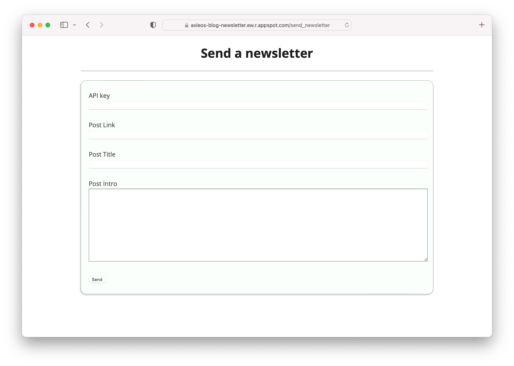
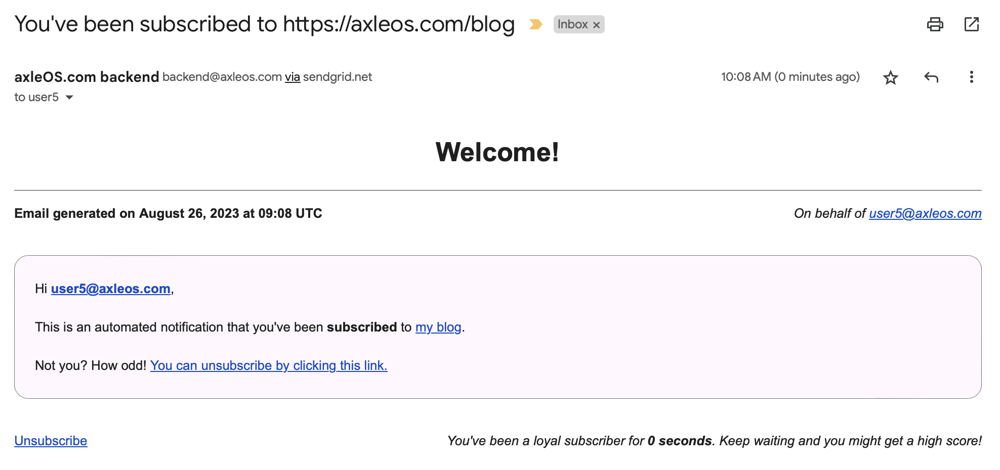

# axle's newsletter backend

This webapp powers the newsletter available on [https://axleos.com/blog](https://axleos.com/blog). [Here's the corresponding blog post with some more details](https://axleos.com/making-a-newsletter-backend/).

A hosted version is available at [https://axleos-blog-newsletter.ew.r.appspot.com/](https://axleos-blog-newsletter.ew.r.appspot.com/).

## Tech stack

1. [Google App Engine](https://code.google.com/appengine/) for hosting.
2. [Falcon](https://falcon.readthedocs.io/en/stable/) and [gunicorn](http://gunicorn.org) for the web stack.
3. [Firestore](https://firebase.google.com/docs/firestore) for storing subscribed users.
4. [SendGrid](https://sendgrid.com) for sending emails.
5. [Neutrinno](https://www.neutrinoapi.com) for validating email addresses.
5. [jinja2](https://jinja.palletsprojects.com/en/3.1.x/) for rendering HTML templates.
6. [pip-tools](https://github.com/jazzband/pip-tools) for managing Python dependencies.

## License

MIT license.
